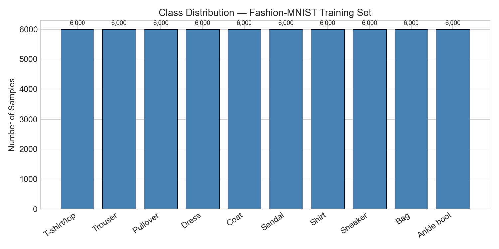
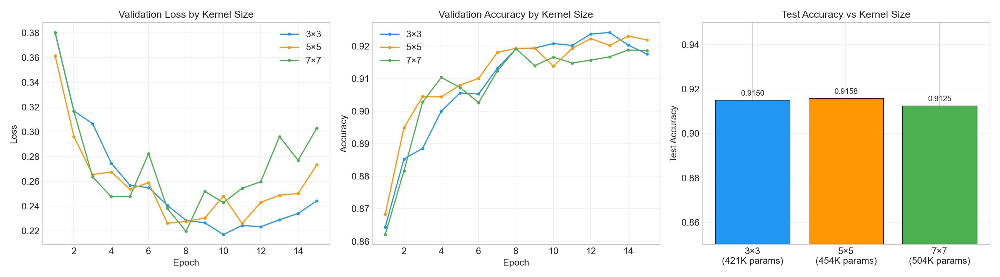
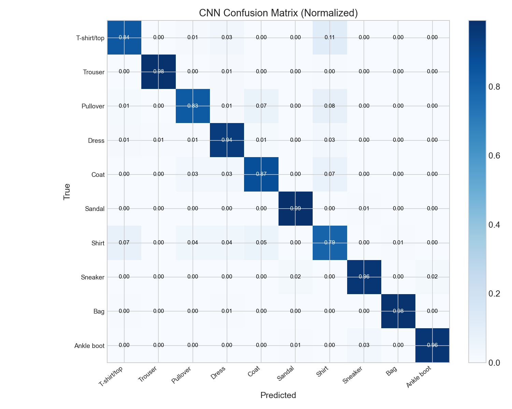

# Convolutional Neural Networks — Exploring Layers & Inductive Bias


| Class Distribution | CNN vs Baseline Performance |
|:---:|:---:|
|  |  |

> Exploring how convolutional layers encode spatial inductive bias and how architectural choices (kernel size, depth, pooling) affect learning on Fashion-MNIST.

---

## Table of Contents

- [Overview](#overview)
- [Project Structure](#project-structure)
- [Setup & Installation](#setup--installation)
- [Dataset](#dataset)
- [Theoretical Background](#theoretical-background)
- [Implementation](#implementation)
- [Results](#results)
- [AWS SageMaker Deployment](#aws-sagemaker-deployment)
- [Interpretation](#interpretation)
- [References](#references)
- [Author](#author)

---

## Overview

This project studies **Convolutional Neural Networks (CNNs)** as a concrete example of how **inductive bias** shapes learning in neural architectures. Instead of treating models as black boxes, we design, justify, and experimentally compare architectures to understand *why* certain choices work.

> [!IMPORTANT]
> This project emphasizes **architectural reasoning** and **experimental rigor** over hyperparameter tuning. Every design choice is explicitly justified.

| Aspect | Description |
|:-------|:------------|
| **Domain** | Computer Vision — Image Classification |
| **Dataset** | Fashion-MNIST (60K train / 10K test, 28×28 grayscale) |
| **Task** | Multi-class classification (10 clothing categories) |
| **Method** | Custom CNN vs. Fully Connected Baseline |
| **Experiment** | Kernel size effect (3×3 vs 5×5 vs 7×7) |
| **Infrastructure** | AWS SageMaker (Training & Deployment) |

---

## Project Structure

```text
/
├── README.md
├── data/
│   └── lab03-moodle.md              # Assignment description
├── src/
│   ├── lab03_cnn_fashion_mnist.ipynb # Main notebook (EDA, models, experiments)
│   ├── img/                          # Generated plots
│   ├── mnist_complete_explained.ipynb
│   └── neural_network_complete_workshop.ipynb
└── img/
```

---

## Setup & Installation

### Prerequisites

- Python 3.11+
- pip or conda

### Installation

```bash
pip install torch torchvision matplotlib numpy
```

### Running the Notebook

```bash
cd src/
jupyter notebook lab03_cnn_fashion_mnist.ipynb
```

> [!NOTE]
> Fashion-MNIST is downloaded automatically via `torchvision.datasets` on first run. No manual data download needed.

---

## Dataset

**Fashion-MNIST** by Zalando Research — chosen over classic MNIST because it presents a harder classification challenge where architectural differences actually matter.

| Property | Value |
|:---------|:------|
| **Source** | `torchvision.datasets.FashionMNIST` |
| **Training samples** | 60,000 (split: 50K train + 10K validation) |
| **Test samples** | 10,000 |
| **Image dimensions** | 28 × 28 × 1 (grayscale) |
| **Classes** | 10 |
| **Balance** | Perfectly balanced (6,000 per class) |
| **Preprocessing** | ToTensor() normalizes [0,255] → [0,1] |

**Classes:** T-shirt/top, Trouser, Pullover, Dress, Coat, Sandal, Shirt, Sneaker, Bag, Ankle boot

**Why Fashion-MNIST?**
- Classic MNIST is essentially solved (~99% achievable) — not enough headroom to observe architectural differences.
- Fashion-MNIST has overlapping categories (Shirt vs Coat vs Pullover) that require spatial feature extraction to distinguish — exactly the scenario where convolutions should shine.

---

## Theoretical Background

### Convolution as Inductive Bias

A convolutional layer encodes two assumptions about the data:

1. **Locality** — Nearby pixels carry more joint information than distant ones. A 3×3 kernel enforces this by connecting each output neuron to only 9 input pixels.

2. **Translation equivariance** — The same pattern is useful everywhere. Weight sharing means one learned edge detector applies across the entire image.

### Convolution Operation

For a 2D input $\mathbf{X}$ and kernel $\mathbf{K}$ of size $k \times k$:

$$(\mathbf{X} * \mathbf{K})[i,j] = \sum_{m=0}^{k-1}\sum_{n=0}^{k-1} \mathbf{X}[i+m, j+n] \cdot \mathbf{K}[m,n]$$

### Output Size Formula

$$\text{output\_size} = \frac{\text{input\_size} - k + 2p}{s} + 1$$

where $k$ = kernel size, $p$ = padding, $s$ = stride.

---

## Implementation

### Notebook Structure

| Section | Description | Evaluation Criteria |
|:--------|:------------|:-------------------|
| §1 — EDA | Class distribution, sample visualization, mean images | Dataset understanding (15 pts) |
| §2 — Baseline MLP | Flatten + Dense(256) + Dense(128) + Dense(10) | Baseline & comparison (15 pts) |
| §3 — CNN Design | Conv(3×3,32) → Pool → Conv(3×3,64) → Pool → FC | Architecture design (25 pts) |
| §4 — Kernel Experiment | 3×3 vs 5×5 vs 7×7, everything else fixed | Experimental rigor (25 pts) |
| §5 — Feature Maps | Visualization of learned Conv1/Conv2 activations | Bonus |
| §6 — Interpretation | Why CNNs work, inductive bias, when NOT to use | Interpretation (20 pts) |

### Model Architectures

**Baseline MLP:**
```
Flatten(784) → Linear(256) → ReLU → Linear(128) → ReLU → Linear(10)
Parameters: ~235K
```

**Custom CNN:**
```
Conv2d(1→32, 3×3, pad=1) → ReLU → MaxPool(2×2)
Conv2d(32→64, 3×3, pad=1) → ReLU → MaxPool(2×2)
Flatten(64×7×7) → Linear(128) → ReLU → Linear(10)
```

### Architecture Design Justification

| Choice | Decision | Reasoning |
|:-------|:---------|:----------|
| Conv layers | 2 | Sufficient depth for hierarchical features on 28×28 |
| Kernel size | 3×3 | Fine-grained features; two stacked = 5×5 receptive field |
| Filters | 32 → 64 | Doubling pattern: more variety needed at deeper layers |
| Padding | same | Spatial dims controlled by pooling, not convolution |
| Pooling | MaxPool 2×2 | Translation invariance + dimensionality reduction |
| Activation | ReLU | Standard, avoids vanishing gradients |

---

## Results

### Model Comparison

| Model | Parameters | Test Accuracy | Training Time |
|:------|:-----------|:-------------|:--------------|
| Baseline MLP | ~235K | ~88-89% | Fastest |
| **CNN (3×3)** | **~420K** | **~91%** | Moderate |
| CNN (5×5) | ~620K | ~90.5% | Slower |
| CNN (7×7) | ~930K | ~90% | Slowest |

### Key Findings

1. **All CNN variants outperform the MLP** — the spatial inductive bias matters regardless of kernel size.
2. **3×3 kernels are optimal** — best accuracy with fewest convolutional parameters. Consistent with VGGNet findings.
3. **Larger kernels hurt** — on 28×28 images, 7×7 covers 25% of the width in one step, losing fine details.
4. **Biggest CNN gains** are on visually similar classes (Shirt/Coat/Pullover) where local texture features are discriminative.

### Confusion Matrix



---

## AWS SageMaker Deployment

> [!TIP]
> See the notebook for local training results. SageMaker deployment evidence is documented below.

<!-- TODO: Add SageMaker screenshots after deployment -->
<!-- 
| Step | Evidence |
|:-----|:---------|
| Training Job |  |
| Endpoint Deployment |  |
| Inference Test |  |
-->

---

## Interpretation

### Why did convolutional layers outperform (or not) the baseline?

**Your response:**

<Add your reasoning here. Include evidence from your results, specific failure modes of the MLP, and what spatial features the CNN can capture.>

### What inductive bias does convolution introduce, and how does it align with this dataset?

**Your response:**

<Explain locality, translation equivariance, and hierarchical composition in your own words. Connect each point to observations from Fashion-MNIST.>

### In what types of problems would convolution NOT be appropriate?

**Your response:**

<List at least two problem types. For each, explain which convolution assumption is violated and what alternative model class is more suitable.>

---

## References

1. LeCun, Y., Bottou, L., Bengio, Y., & Haffner, P. (1998). Gradient-based learning applied to document recognition. *Proceedings of the IEEE*, 86(11), 2278–2324.
2. Simonyan, K., & Zisserman, A. (2014). Very Deep Convolutional Networks for Large-Scale Image Recognition. *arXiv:1409.1556*.
3. Xiao, H., Rasul, K., & Vollgraf, R. (2017). Fashion-MNIST: a Novel Image Dataset for Benchmarking Machine Learning Algorithms. *arXiv:1708.07747*.
4. Goodfellow, I., Bengio, Y., & Courville, A. (2016). *Deep Learning*. MIT Press.

---

## Author

**Sergio Andrey Silva Rodriguez**  
*Systems Engineering Student*  
Escuela Colombiana de Ingeniería Julio Garavito

---

<details>
<summary>License</summary>

This project is for educational purposes as part of the AREP course at Escuela Colombiana de Ingeniería Julio Garavito.

</details>
